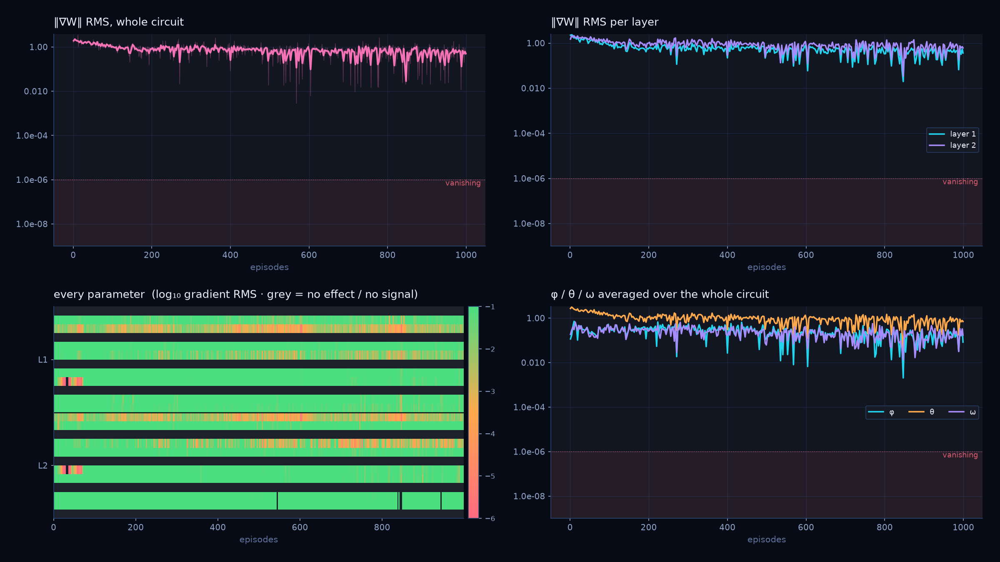

# Visualizing a VQC in Reinforcement Learning

This repository studies a variational quantum circuit (VQC) as the function
approximator in deep Q-learning. The experiment couples a stochastic 4×3 grid
world, an exact Bellman reference, and a four-qubit PennyLane/PyTorch model.
The GUI exposes the circuit, parameter trajectories, gradients, policy, live
state utilities, and episode-level rewards in the same run directory. Its
Overview keeps all five live panels visible; Focus enlarges one metric and a
slider selects MSE, loss, reward, utilities, or the learning schedule.

## Method

For state \(s\), the circuit returns one value per action,
\[
Q_\theta(s,a)=\kappa\langle Z_a\rangle_{U_\theta E(s)|0\rangle}.
\]
The scalar \(\kappa\) is the configured output scale.
Training uses replay minibatches and the one-step target
\[
y=r+\gamma(1-d)\max_{a'}Q_{\theta^-}(s',a'),
\qquad
\mathcal L(\theta)=\tfrac12\bigl(Q_\theta(s,a)-y\bigr)^2.
\]
The target network, epsilon-greedy interaction, stochastic slip model, and
Bellman value iteration are configurable. Epsilon can decay linearly,
exponentially, with a cosine schedule, or remain constant; the GUI exposes its
duration and update interval. Learning-rate control has an explicit transient
(`LR_0`, number of optimizer steps), a post-transient value, halving interval,
and minimum. `Config.notebook()` reproduces the legacy experiment; the default
flags enable the corrected dynamics.

## Figures from a completed run


*Figure 1 — Final circuit view: the VQC layout and gradient RMS for the
selected episode/state. This PNG was generated by
`runs/gui_20260922_141928`.*



*Figure 2 — Whole-circuit gradient landscape across training. The logarithmic
scale separates finite signal from structural and episode-level zeros.*

## Quick start

```bash
python3 -m venv .venv
.venv/bin/pip install -r requirements.txt
./gui.py
```

Tk is required by the GUI (`sudo apt install python3-tk` on Debian/Ubuntu).
The command-line entry point is:

```bash
.venv/bin/python -m quantum_rl --episodes 1000 --max-time 40 \
  --lr 0.01 --out-dir runs/example
```

Each run saves its configuration and Bellman reference, progress, trajectories,
policies, curves, circuit views, `params_history.npz`, and
`gradient_stats.csv`. Relative output paths are resolved from the project directory; timestamped folders under `runs/` are used by default.

## Reproducibility and diagnostics

Use a fixed seed and retain `summary.json` together with the run directory.
The diagnostic analyses and interpretation of the failure mode are in
[`diagnostics/README.md`](diagnostics/README.md). The complete test suite can be run with:

```bash
.venv/bin/pip install pytest
.venv/bin/python -m pytest tests -q
```

The four corrected notebook behaviours are explicit `FixFlags`: (i) the TD
prediction uses \(Q(s,a)\), not \(Q(s',a)\); (ii) epsilon-greedy exploration is
not inverted; (iii) sampled environmental slips are preserved; and (iv) the
greedy Bellman policy includes reward and discount. The obsolete learning-rate
schedule and biased running averages are corrected defaults as well.

Two classes of zeros are scientifically relevant. In this architecture, the
first-layer `φ` angles and last-layer `ω` angles are structurally unobservable
(8 of the `12L` rotation angles). Other parameters can have an exact
episode-level zero when no updated action depends on them. The GUI reports
these cases separately and excludes zeros from RMS/heatmap summaries rather
than presenting them as small gradients.

## Package map

`environment.py` implements transitions and rewards; `bellman.py` computes the
reference; `circuit.py` defines encoding and the VQC; `agent.py` implements
action selection and replay; `train.py` runs optimization; `analysis.py`,
`plotting.py`, and `outputs.py` produce diagnostics. `gui.py` and the
`*_view.py` modules provide interactive visualization.

The project is a compact, inspectable experiment: figures are derived from
saved runs, and every plotted quantity can be traced to the episode-level
state, parameters, or gradients recorded on disk.
