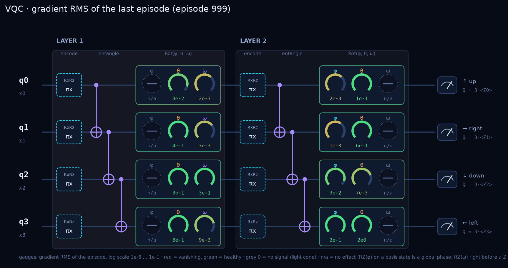
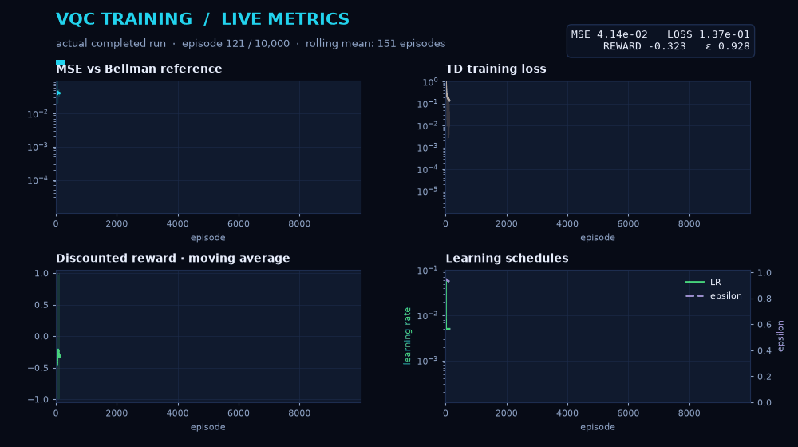

# Visualizing a VQC in Reinforcement Learning

This project studies a four-qubit variational quantum circuit (VQC) as the
action-value function in deep Q-learning on a stochastic 4×3 grid world. Exact
Bellman value iteration provides a reference for learned values and policies.

## Method

For encoded state \(E(s)\), one circuit expectation estimates each action value:
\[
Q_\theta(s,a)=\kappa\langle Z_a\rangle_{U_\theta E(s)|0\rangle}.
\]
Replay training minimizes the squared temporal-difference error, with a target
network:
\[
y=r+\gamma(1-d)\max_{a'}Q_{\theta^-}(s',a'),\qquad
\mathcal L=\tfrac12(Q_\theta(s,a)-y)^2.
\]

## Live visualization





The circuit view exposes parameter gradients; the animation replays a real
10,000-episode run with MSE, TD loss, discounted reward, learning rate, and
epsilon updating over time. Structurally zero gradients are identified and
excluded from aggregate gradient statistics.

## Quick start

```bash
cd vqc-rl
python3 -m venv .venv
.venv/bin/pip install -r requirements.txt
./gui.py
```

Tk is required by the GUI. For command-line training, run
`.venv/bin/python -m quantum_rl --help`.

## GUI and saved runs

The GUI visualizes the circuit, parameter trajectories, gradients, policy,
state utilities, rewards, loss, and Bellman-reference error. Each run stores
its configuration and reference values alongside progress, policies, plots,
parameter history, and gradient statistics.

## Reproducibility and original implementation

Notebook-compatibility mode is verified bit-for-bit against the original implementation. The
corrected default fixes its TD-state swap: the prediction must use `Q(s,a)`, not
`Q(s′,a)`. The original notebooks are retained in [original/](../original/) for historical attribution.
